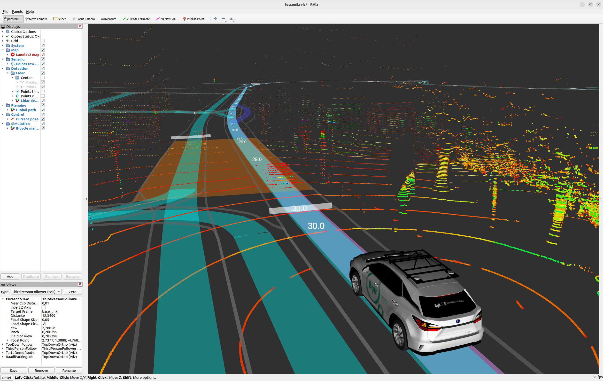
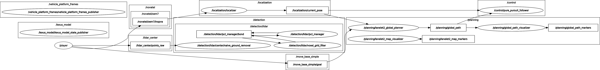
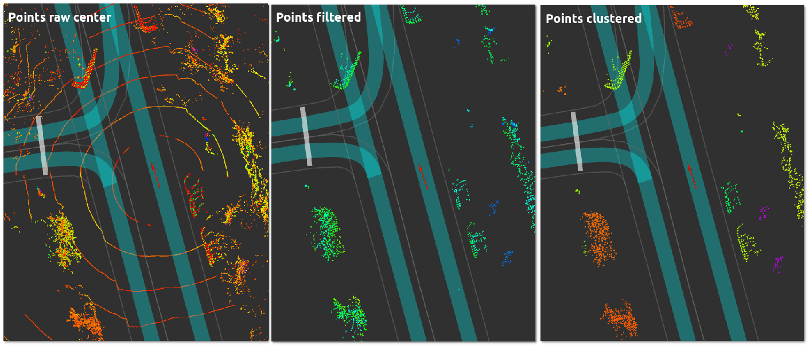
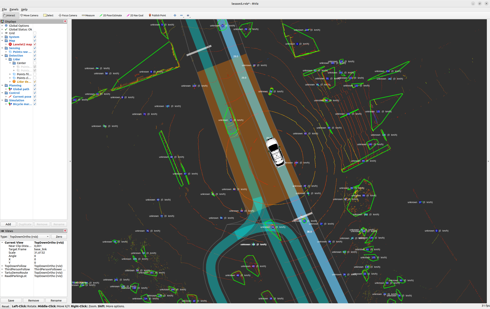

[< Previous lesson](../lesson4/) -- [**Main Readme**](../README.md) -- [Next lesson >](../lesson6/)

# Lesson 5 - Obstacle Detection

In this lesson, we will implement obstacle detection using lidar point cloud data. The raw point cloud goes through a processing pipeline: ground removal separates ground from non-ground points, a voxel grid filter downsamples the result, and then your nodes will cluster the remaining points into objects. These detected objects will be used by the local planner in later lessons to control the ego vehicle's speed around obstacles.

You will implement two nodes:
* `points_clusterer.py` — takes filtered points, clusters them using the DBSCAN algorithm, and publishes the clustered point cloud
* `cluster_detector.py` — takes the clustered points, converts each cluster into a detected object with a centroid and convex hull boundary, and publishes a `DetectedObjectArray`

### Expected outcome
* Understanding of the algorithmic and modular approach to obstacle detection
* Point cloud from lidar scan is transformed to clusters and detected object polygons
* These detected objects will be used in the next step (local planner) for ego vehicle speed control


## 0. Explore the detection pipeline

Before writing any code, launch the system and explore how the detection pipeline is set up.

##### Instructions
* `roslaunch autoware_mini_tutorial lesson5.launch use_detection:=false`
  - The `use_detection:=false` flag disables your detection nodes so you can first explore the pipeline without them.
  - The launch file plays back a rosbag with lidar data, runs your localizer and global planner from previous lessons, and starts the detection pipeline up to the voxel grid filter.
* In RViz, explore the point cloud visualizations on the left panel:
  - `Sensing / Points raw center` — all points from the lidar scan
  - `Detection / Lidar / Center / Points no ground` — result of ground removal
  - `Detection / Lidar / Points filtered` — result of voxel grid filter (downsampled)
  - Switch between `TopDownFollow` and `ThirdPersonFollow` views to compare the different stages
  - Hint: press space in the launch console to pause bag playback for easier inspection



* Run `rqt_graph` (`Nodes/Topics (all)` option) to see how the pipeline nodes are connected. Note how `/player` publishes `/lidar_center/points_raw`, which flows through ground removal and filtering — your `points_clusterer` node will connect after the filter. With `use_detection:=false`, the clusterer and detector nodes are not shown — they will appear once you launch without the flag.



## 1. Cluster the points

We will start with the `points_clusterer` node. Open [`lesson5/nodes/points_clusterer.py`](nodes/points_clusterer.py) — this skeleton receives LIDAR points and clusters them using the [DBSCAN](https://scikit-learn.org/stable/modules/clustering.html#dbscan) algorithm.

DBSCAN groups nearby points into clusters based on two parameters:
- `cluster_epsilon` — maximum distance between two points in the same cluster
- `cluster_min_samples` — minimum number of points to form a cluster

Points that don't belong to any cluster are labeled as noise (label = -1).

##### Instructions
Find `TODO 1` — it appears in two places:

1. In `__init__`: Create the DBSCAN clusterer object using the loaded parameters:

```python
self.clusterer = DBSCAN(eps=self.cluster_epsilon, min_samples=self.cluster_min_samples)
```

2. In `points_callback`: Extract point coordinates from the message and run clustering:

```python
data = numpify(msg)
points = structured_to_unstructured(data[['x', 'y', 'z']], dtype=np.float32)
labels = self.clusterer.fit_predict(points)
```

[`numpify`](https://github.com/eric-wieser/ros_numpy) converts a ROS `PointCloud2` message into a numpy structured array. [`structured_to_unstructured`](https://numpy.org/doc/stable/user/basics.rec.html) extracts specific fields into a regular (N, 3) array.

##### Validation
* Add a temporary `print(points.shape, labels.shape)` after the clustering to verify the output.
* `roslaunch autoware_mini_tutorial lesson5.launch`
* You should see matching shapes like:
```
(7330, 3) (7330,)
(7289, 3) (7289,)
(7297, 3) (7297,)
```
* Remove the print statement before continuing.


## 2. Publish clustered points

Now we need to combine the points with their cluster labels, filter out noise, and publish as a new `PointCloud2` message. This keeps the pipeline modular — the next node receives clustered points and can focus on object creation.

##### Instructions
Find `TODO 2` in `points_callback`. After clustering:

```python
# Concatenate points with labels
points_labeled = ...

# Filter out noise points (label == -1)
points_labeled = ...

# Convert to structured PointCloud2 format
data = unstructured_to_structured(points_labeled, dtype=np.dtype([
    ('x', np.float32),
    ('y', np.float32),
    ('z', np.float32),
    ('label', np.int32)
]))

# Create the message using msgify, set the correct header and publish
# TODO
```

##### Validation
* `roslaunch autoware_mini_tutorial lesson5.launch`
* Run `rostopic hz /detection/lidar/points_clustered` — the average rate should be close to 10Hz.
* In RViz, enable `Points clustered` — clusters should be displayed with different colors.



## 3. Create detected objects

**Now we switch to the second node.** Open [`lesson5/nodes/cluster_detector.py`](nodes/cluster_detector.py) — this skeleton receives clustered points from `points_clusterer` and converts them into `DetectedObject` messages.

`DetectedObject` and `DetectedObjectArray` are custom message types of `autoware_mini`, so you won't find documentation for them online. Their definitions — like those of `Path`, `Waypoint`, and `VehicleCommand` from the previous lessons — are `.msg` files in the `autoware_mini/msg/` directory, and you can print the fields of any message type with `rosmsg show autoware_mini/DetectedObject`. Custom messages are created and populated the same way as standard ROS messages: instantiate the class and fill in the fields.

Study the given code in `cluster_callback`:
- The clustered point cloud is converted to a numpy array with x, y, z, and label columns
- If the points are in a different frame than `output_frame` (which is `map`), they are transformed using a TF lookup and homogeneous coordinate multiplication
- After the transform, the label column (column 3) are overwritten with the cluster labels from the message

##### Instructions
Find `TODO 3` in `cluster_callback`. After the TF transform block create a `DetectedObjectArray` and iterate through each cluster label to create a `DetectedObject` for clusters that meet the minimum size requirement. Assign the correct points with corresponding cluster labels to each object.

```python
result_object_array = DetectedObjectArray()
result_object_array.header.stamp = msg.header.stamp
result_object_array.header.frame_id = self.output_frame

for i in range(int(max(points[:, 3]) + 1)):
    # Find all points with a correct label
    points3d = ...
```

##### Validation
* Add a temporary printout inside the loop to verify cluster sizes. You should see cluster IDs with different point counts.
* `roslaunch autoware_mini_tutorial lesson5.launch`
* Remove the print statement before continuing.

## 4. Calculate centroid and convex hull

For each cluster, we need to calculate its centroid (center point) and convex hull (2D boundary polygon). These will be used by the visualizer and local planner.

##### Instructions
Find `TODO 4` in `cluster_callback`, inside the loop from section 3:

```python
# Calculate centroid from points3d
centroid = ...

# Calculate convex hull using 2D points. Z-axis for the hull is set to the minimum z of the cluster (bottom of the object)
points_2d = MultiPoint(points3d[:, :2])
hull = points_2d.convex_hull
# The hull is a polygon only for 3+ non-collinear points; a line or a point is not a usable obstacle outline
if hull.geom_type != "Polygon":
    continue
min_z = float(np.min(points3d[:, 2]))

# Hull coordinates as (N, 2) array; drop the last point — in a closed ring it duplicates the first one
hull_points_2d = np.array(hull.exterior.coords)[:-1]
# Append min_z as the z-coordinate to every hull point and flatten into [x1, y1, z1, x2, y2, z2, ...]
convex_hull_points = np.hstack((hull_points_2d, np.full((len(hull_points_2d), 1), min_z))).ravel().tolist()
```

The convex hull is computed in 2D (x, y only) using [Shapely's MultiPoint](https://shapely.readthedocs.io/en/stable/reference/shapely.MultiPoint.html). The hull coordinates are flattened into a list of `[x, y, z]` values, using `min_z` (the bottom of the cluster) as the z-coordinate for all hull points.

Now create a `DetectedObject` and populate its fields:

```python
obj = DetectedObject()
obj.id = i
obj.label = "unknown"
obj.color = BLUE80P
obj.valid = True
obj.centroid.x = ...
obj.centroid.y = ...
obj.centroid.z = ...
obj.convex_hull = convex_hull_points
obj.position_reliable = True
obj.velocity_reliable = False
obj.acceleration_reliable = False

result_object_array.objects.append(obj)
```

After the loop, publish the `DetectedObjectArray`.

##### Validation
* `roslaunch autoware_mini_tutorial lesson5.launch`
* There should be no errors when launched.
* Set a goal and let the vehicle drive. Enable `Lidar detections` in RViz — you should see:
  - Blue centroids
  - Cluster borders (convex hulls) for each object
  - Label `unknown` with the object id and speed (speed is 0 since there is no tracking yet)



* Clean the code (remove any debugging printouts) and commit to your repo.
