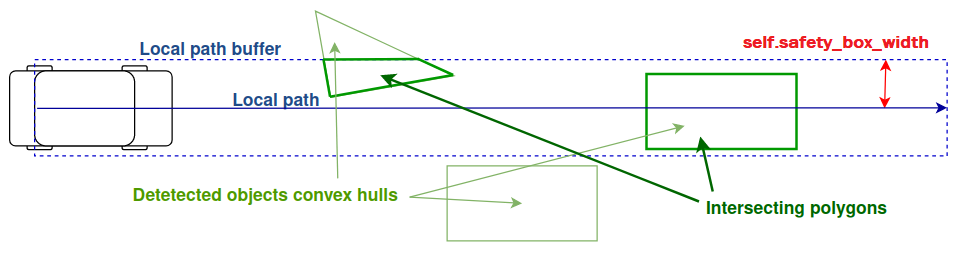
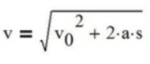
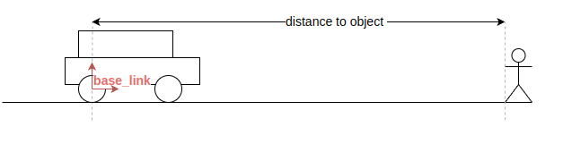
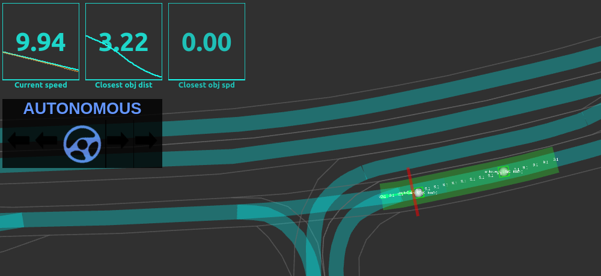
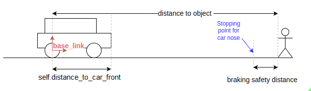
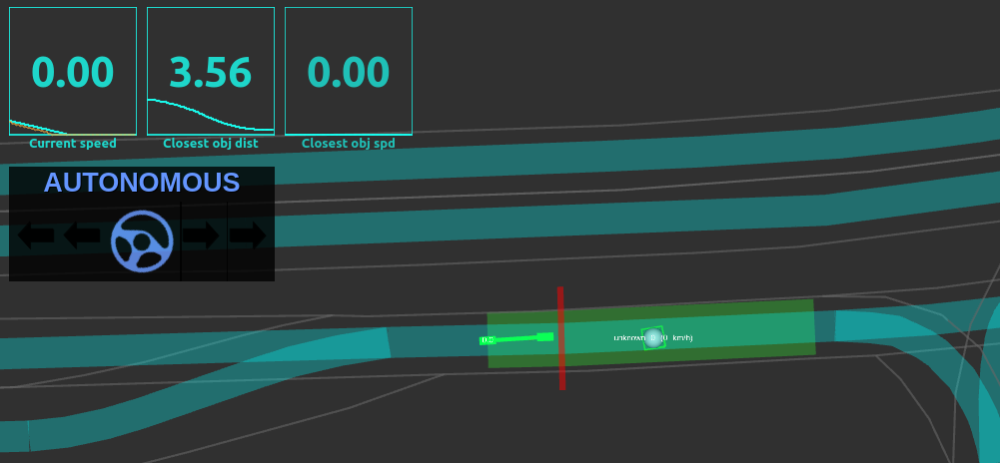
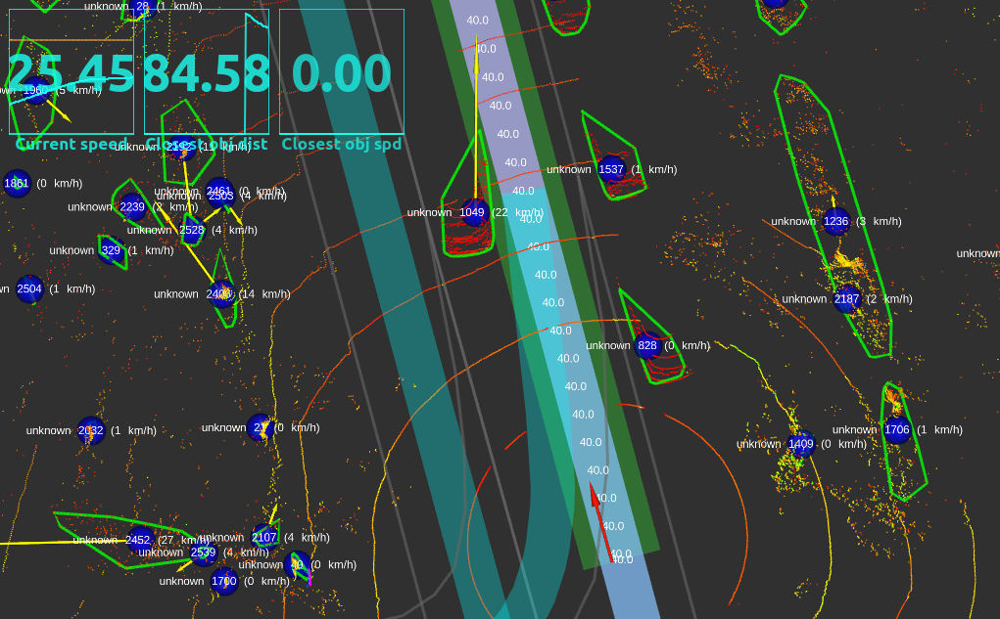
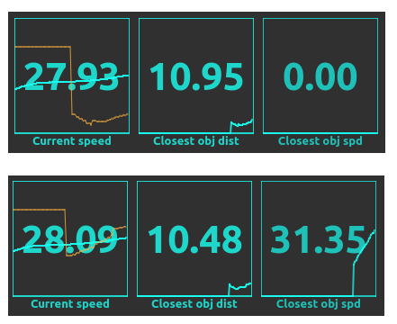
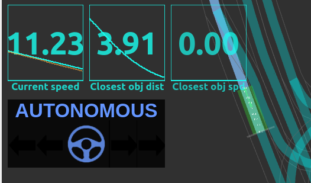

[< Previous lesson](../lesson5/) -- [**Main Readme**](../README.md) -- [Next lesson >](../lesson7/)

# Lesson 6 - Local Planning

In this lesson, you will create a local planning module that controls the ego vehicle's speed based on obstacles and goal points. The global path from lesson 4 provides waypoints with target speeds, but the local planner must react to dynamic conditions: obstacles on the road require braking, and the vehicle must decelerate smoothly when approaching its destination.

The key concept of our local planner is **collision points**. A collision point is a generalized representation of any condition ahead that requires the vehicle to change speed — it could be a detected obstacle, the goal destination, a traffic light stop line, or a pedestrian on a crosswalk. Each collision point carries a position, velocity and established safety distance. This abstraction decouples *what* causes a speed change from *how* the vehicle reacts to it: the collision checker produces collision points, and the speed planner consumes them without knowing their origin. In this lesson, you will implement a simplified collision checker that processes two categories of the obstacles: obstacles and the goal point.

You will implement two nodes:
* `simple_collision_checker.py` — checks if detected objects intersect with the local path and creates collision points for obstacles and the goal destination
* `simple_speed_planner.py` — takes collision points and the local path, calculates safe target velocities using kinematics, and publishes a modified local path with reduced speeds

A third node, `local_path_extractor.py`, is provided — it extracts a fixed-length portion of the global path starting at the ego vehicle's position and publishes it at a constant rate.

### Expected outcome
* Understanding the concept of collision points and how to process different types of them
* Understanding of how the ego vehicle reacts to collision points (combination of distance and speed)
* The local planner takes over longitudinal (speed) control by reacting to obstacles and goal points


## 0. Understand the local path extractor

Before writing any code, explore the provided [`lesson6/nodes/local_path_extractor.py`](nodes/local_path_extractor.py) node.

##### Instructions
* Read through the code and understand:
  - What publishers and subscribers are created
  - How `rospy.Timer` is used to publish the extracted local path at a constant rate (10 Hz)
  - How `threading.Lock` safely transfers data between the subscriber callback and the timer callback
  - What happens when an empty global path is received vs. a non-empty one

##### Validation
* `roslaunch autoware_mini_tutorial lesson6_sim.launch use_extracted_local_path:=true`
* Place a destination — the global path and extracted local path should appear. The ego vehicle starts to drive.
* Run `rostopic hz /planning/extracted_local_path` in a separate terminal to verify it publishes at ~10 Hz.
* The `use_extracted_local_path:=true` flag routes the extracted local path directly to the controller, bypassing your collision checker and speed planner nodes.


## 1. Create obstacle collision points

Open [`lesson6/nodes/simple_collision_checker.py`](nodes/simple_collision_checker.py) — this skeleton receives the extracted local path and detected objects, and should create collision points where objects intersect with the path.

Collision points are published as a `PointCloud2` message using the structured `DTYPE` array defined at the top of the file. Each collision point has position, velocity, a safety distance (`distance_to_stop`), and a category.

The node creates a buffer around the local path using Shapely, then checks which detected objects' convex hulls intersect with this buffer.



##### Instructions
Find `TODO 1` in `path_callback`:

1. Create a Shapely `LineString` from the local path waypoints and buffer it:

```python
local_path_linestring = ...
local_path_buffer = local_path_linestring.buffer(self.safety_box_width / 2, cap_style="flat")
shapely.prepare(local_path_buffer)
```

2. Check if detected objects are available and iterate over them. For each object, create a Shapely Polygon from its convex hull, check intersection, and create collision points:

```python
if detected_objects is not None and len(detected_objects) > 0:
    for obj in detected_objects:
        object_polygon = shapely.Polygon(...)

        if local_path_buffer.intersects(object_polygon):
            # TODO: calculate the collision point properties from the intersection points geometry and object metadata
            
            for x, y in intersection_points:
                collision_points = np.append(collision_points, np.array([(...
                    )], dtype=DTYPE))
```

3. After the loop, publish the collision points:

```python
collision_points_msg = msgify(PointCloud2, collision_points)
collision_points_msg.header = msg.header
self.collision_points_pub.publish(collision_points_msg)
```

##### Validation
* Add a temporary printout of the collision points array for debugging.
* `roslaunch autoware_mini_tutorial lesson6_sim.launch`
* Place the destination and place simulated obstacles on the path using the RViz `Publish Point` button.
* You should see collision points printed with correct coordinates, velocities (0 for simulated objects), and categories.
* Experiment with placing obstacles at the edge of the local path buffer.
* Remove the printout before continuing.


## 2. Basic speed planner

Now open [`lesson6/nodes/simple_speed_planner.py`](nodes/simple_speed_planner.py) — this skeleton receives synchronized collision points and extracted local path messages, and should calculate target velocities to safely stop before obstacles.

The skeleton already provides:
- `ApproximateTimeSynchronizer` to synchronize `collision_points` and `extracted_local_path` topics
- Early returns for missing data and empty inputs
- The local path linestring and collision point distance projection
- Two helper functions: `get_heading_at_distance` and `project_vector_to_heading` (used in later sections)

For now, assume all collision points are static (velocity = 0). The target velocity formula simplifies to:



* `v` — target velocity
* `v0` — object velocity (0 for static objects)
* `a` — deceleration (`self.default_deceleration`)
* `s` — distance to object (collision point distance along the local path)



##### Instructions
Find `TODO 2` in `collision_points_and_path_callback`:

1. Calculate target velocities for all collision points using the simplified formula. Distances to collision points must be calculated along the local path, not straight-line distance. Use the provided `collision_point_distances` which are already projected onto the path:

```python
calculated_target_velocities = ...
```

2. Find the minimum target velocity and the index of the collision point causing it. Overwrite waypoint speeds:

```python
target_velocity = np.min(calculated_target_velocities)

for i, wp in enumerate(local_path_msg.waypoints):
    wp.speed = min(target_velocity, wp.speed)
```

3. Publish the modified path:

```python
closest_object_distance = collision_point_distances[np.argmin(calculated_target_velocities)]
collision_point_category = collision_points[np.argmin(calculated_target_velocities)]["category"]

path = Path()
path.header = local_path_msg.header
path.waypoints = local_path_msg.waypoints
path.closest_object_distance = closest_object_distance
path.closest_object_velocity = 0
path.is_blocked = True
path.stopping_point_distance = closest_object_distance
path.collision_point_category = collision_point_category
self.local_path_pub.publish(path)
```

##### Validation
* `roslaunch autoware_mini_tutorial lesson6_sim.launch`
* Place the goal point and add obstacles on the path.
* The stopping point (red wall) should appear at the closest obstacle.
* Observe the target velocity graph — it should decrease when the ego vehicle approaches the object.
* Note: the ego vehicle drives into the collision point because we haven't added safety distances yet.




## 3. Add braking safety distance

The ego vehicle currently stops when `base_link` reaches the collision point. We need to stop *before* the obstacle by accounting for:
* `self.distance_to_car_front` — distance from `base_link` to the car's nose
* `distance_to_stop` — additional buffer zone before the obstacle, stored in each collision point's `distance_to_stop` field. set in collision checker based on the object's category.



##### Instructions
Find `TODO 3` — adjust the distance calculation:

```python
collision_point_braking_distances = ...
target_distances = collision_point_distances - ...
```

Use `target_distances` instead of raw `collision_point_distances` in the target velocity formula. Update `closest_object_distance` to subtract `distance_to_car_front`, and `stopping_point_distance` to subtract `collision_point_braking_distances`.

##### Validation
* `roslaunch autoware_mini_tutorial lesson6_sim.launch`
* Place obstacles on the path.
* The ego vehicle should now stop so that its front touches the stopping point (red wall).
* `closest_object_distance` should show a value close to `braking_safety_distance_obstacle`.




## 4. Calculate collision point speed

Detected objects often move. The tracker node in Autoware Mini assigns velocity vectors. To calculate the correct target velocity, we need to project the object's velocity onto the path heading at the collision point location.

##### Instructions
Find `TODO 4`:

1. For each collision point, get the heading of the path at that distance and project the velocity vector onto it:

```python
collision_point_path_headings = [self.get_heading_at_distance(local_path_linestring, d) for d in collision_point_distances]
collision_point_velocities = np.array([self.project_vector_to_heading(heading, Vector3(vx, vy, vz))
                            for heading, (vx, vy, vz) in zip(collision_point_path_headings, collision_points[['vx', 'vy', 'vz']])])
```

2. Add a temporary printout comparing object speed (norm) with projected speed.

##### Validation (OUTDATED — values will differ with new bag)
* `roslaunch autoware_mini_tutorial lesson6_bag.launch use_tracking:=true`
* Set the goal point further away. There should be intersecting objects with non-zero velocities.
* The printout should show object speed and projected speed converging when driving directions align.




## 5. Account for collision point speed

Now include the projected velocity in the target velocity calculation. Previously, we selected the closest collision point. When considering speed, a fast-moving object ahead may need less braking than a stationary object further away. We need to calculate target velocities for *all* collision points and select the minimum.

##### Instructions
Find `TODO 5`:

1. Use the full formula with collision point velocities. For objects moving toward us (negative projected speed), we use `approaching_speed = min(v0, 0)` added outside the square root:

```python
approaching_speeds = np.minimum(collision_point_velocities, 0)
calculated_target_velocities = np.maximum(0,
    approaching_speeds + np.sqrt(np.maximum(0,
        collision_point_velocities ** 2 + 2 * self.default_deceleration * target_distances)))
```

2. Find the collision point with the minimum target velocity and update all metadata:

```python
closest_object_distance = ... # calculated from the car nose to the collision point, including braking distance
closest_object_velocity = ...
closest_object_braking = ...
collision_point_category = ...
stopping_point_distance = ... # calculated from the base link to the stopping point
target_velocity = ...
```

3. Update the published path to use `closest_object_velocity` instead of 0.

##### Validation (OUTDATED — values will differ with new bag)
* Run with and without tracking to compare:
  - `roslaunch autoware_mini_tutorial lesson6_bag.launch`
  - `roslaunch autoware_mini_tutorial lesson6_bag.launch use_tracking:=true`
* With tracking, the target velocity drop should be smaller when following a moving object.




## 6. Modify target velocity with reaction time

When driving behind a moving object, we need a safe following distance that increases with speed. We achieve this by subtracting `braking_reaction_time * abs(velocity)` from the distance — effectively making the ego vehicle "think" it is closer to the object. We use `abs()` because approaching objects (negative velocity) also need increased safety distance.

##### Instructions
Find `TODO 6` — adjust `target_distances` to include reaction time:

```python
target_distances = ...
```

##### Validation
* `roslaunch autoware_mini_tutorial lesson6_bag.launch use_tracking:=true`
* Place the destination further away and verify target velocity looks reasonable.
* `roslaunch autoware_mini_tutorial lesson6_sim.launch` — place multiple obstacles, remove them, and place them again. There should be no errors.


## 7. Add goal point as collision point

The ego vehicle should decelerate when approaching the goal and stop smoothly. We use the same braking logic as for obstacles — the goal point is just another collision point with category 1.

The skeleton already provides the `braking_safety_distance_goal` parameter, the `goal_point` variable, the `global_path` subscriber, and the `global_path_callback` that extracts the last waypoint. The `goal_point` is also already included in the lock acquisition in `path_callback`.

##### Instructions
Find `TODO 7` in `path_callback` of `simple_collision_checker.py`. After the obstacle collision points loop, check if the goal point is within the buffered local path and add it as a collision point:

```python
if goal_point is not None:
    goal_point_shapely = shapely.Point(goal_point.x, goal_point.y)
    if local_path_buffer.intersects(goal_point_shapely.buffer(0.1)):
        collision_points = np.append(collision_points, np.array(
            [(...
              )], dtype=DTYPE))
```

Make sure to publish collision points after all checks (obstacles + goal).

##### Validation
* `roslaunch autoware_mini_tutorial lesson6_sim.launch`
* Set the goal point — the ego vehicle should start driving, then slow down and stop at the goal.
* A grey wall (stopping point) should appear at the end of the local path as the vehicle approaches.
* Try placing obstacles and removing them — the system should handle both obstacle and goal collision points.



* Clean the code (remove any debugging printouts) and commit to your repo.
