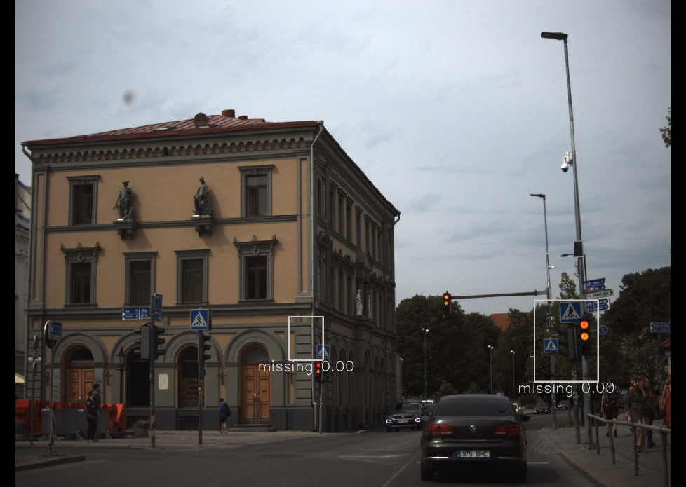
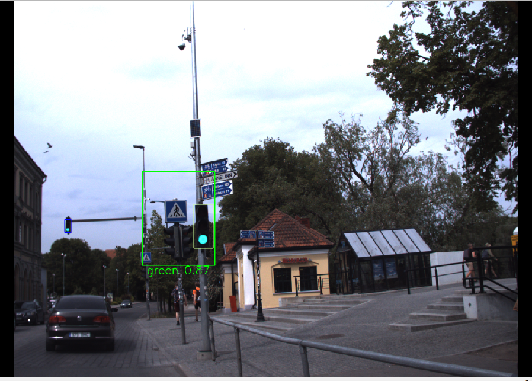

[< Previous lesson](../lesson6/) -- [**Main Readme**](../README.md) -- [Next lesson >](../lesson8/)

# Lesson 7 - Traffic light detection

In this lesson, you will implement camera-based traffic light detection and connect it to the local planner from lesson 6. The ego vehicle should stop at a stop line when the corresponding traffic light is red and drive on when it is green.

The detection node uses a YOLO object detection model that finds and classifies all traffic lights visible in the camera image, while the lanelet2 map tells us where the traffic lights should appear in the image. The two sources are combined by matching the map-projected regions with the YOLO detections:

* The lanelet2 map stores each traffic light's coordinates and links it to a stop line. Projecting these corners into the camera image gives a map ROI (region of interest) — where the traffic light should be if it is in the camera's view.
* The YOLO model, run on the full camera image, returns bounding boxes with a classified state (green, yellow, red, unknown).
* Each map ROI is matched with the overlapping YOLO detection, giving a status for the corresponding stop line. A red or yellow light means STOP, green means GO. If no detection overlaps a map ROI, the status is MISSING.

The stop line statuses from both front cameras are merged by the `traffic_light_majority_merger` node (provided by `autoware_mini`) and published as `/detection/traffic_light_status`. In the final task, you will extend your collision checker from lesson 6 to convert stop lines with a STOP status into collision points, so the speed planner already knows how to react to them.

You will implement:
* `yolo_traffic_light_detector.py` — a new node in [`lesson7/nodes/`](nodes/)
* traffic light stop line collision points in [`lesson6/nodes/simple_collision_checker.py`](../lesson6/nodes/simple_collision_checker.py)

### Expected outcome
* Understanding how traffic light location on the map and a neural network processing complement each other for traffic light detection
* A node that publishes stop line statuses that the local planner can react to
* Local planner correctly stops before red traffic lights and continues moving when they turn green


## 1. Preparation

Open [`lesson7/nodes/yolo_traffic_light_detector.py`](nodes/yolo_traffic_light_detector.py) and familiarize yourself with the skeleton:

* The YOLO model is wrapped by the `Yolo11Model` class (from the `autoware_mini` library) — `self.yolo_model.predict(image)` returns bounding boxes, classes and confidence scores
* The dictionaries at the top of the file map the four main YOLO classes to strings, colors and stop line statuses.
* In `camera_image_callback`, the camera image is converted to an OpenCV image. At the end of the callback, empty status array is published.
* The results are published as a [`StopLineStatusArray`](https://github.com/UT-ADL/autoware_mini/blob/main/msg/StopLineStatusArray.msg) message containing [`StopLineStatus`](https://github.com/UT-ADL/autoware_mini/blob/main/msg/StopLineStatus.msg) messages: red and yellow lights both map to `STATUS_STOP`, green to `STATUS_GO`, and a map ROI with no matching detection to `STATUS_MISSING`

##### Validation
* Run `roslaunch autoware_mini_tutorial lesson7.launch`
* Everything should run without errors: the map with stop lines, the ego vehicle driving the recorded route, and detected objects should be visible in RViz.
* Run `rosnode info /detection/camera1/yolo_traffic_light_detector` in another console to see the node's topics:
   - publishes `/detection/camera1/traffic_light_roi` (preview image) and `/detection/camera1/traffic_light_status`
   - subscribes to `/camera_fl/camera_info`, `/camera_fl/image_raw` and `/planning/local_path`
* The same node also runs as `/detection/camera2/...` for the right camera.
* Camera images should be visible in the two image panels in RViz 
* Check `rostopic echo /detection/traffic_light_status` — the merger publishes nothing yet, because the detector nodes are not publishing their statuses.


## 2. Get the stop lines on the path

The map contains many traffic lights, but only the ones controlling a stop line on our path matter. The stop line geometries were extracted from the map into `self.stop_lines` in `__init__`; the local path arrives in `local_path_callback`. Whenever a new local path is received, we recalculate which stop lines intersect with it.

##### Instructions
Find `TODO 1` in `local_path_callback`:

1. The code should only run when the local path has waypoints (`local_path_msg.waypoints`)
2. Create a shapely `LineString` from the waypoint positions
3. Loop over `self.stop_lines.items()` and use shapely [intersects](https://shapely.readthedocs.io/en/stable/reference/shapely.intersects.html) to test each stop line against the local path
4. Add a temporary printout of `stop_line_ids_on_path` after the loop

##### Validation
* Run `roslaunch autoware_mini_tutorial lesson7.launch`
* Place a destination further along the road, past the traffic light stop line — the local path appears
* The id of the intersecting stop line should be printed while the stop line is within the local path ahead of the ego vehicle:

    ```
    stop_line_ids_on_path: [5003023]
    ```


## 3. Extract traffic light ROIs from the map

Knowing that a stop line with traffic lights is on our path, we now determine where its traffic lights should appear in the camera image. For that, the traffic light corner coordinates need to be transformed from the map frame into the camera frame and projected into pixel coordinates.

The projection loop lives in `calculate_roi_coordinates`. Most of it is given: converting the ROI extent from meters to pixels, clipping against the image borders, and discarding traffic lights that are not fully in the image or are too small. You implement the geometric core — the transform and the projection.

##### Instructions
Find `TODO 2` in `camera_image_callback`:

1. Look up the transform and calculate the map ROIs using the `lookup_transform` pattern with a try/except block:
    ```python
    try:
        transform = self.tf_buffer.lookup_transform(...)
    except (tf2_ros.TransformException, rospy.ROSTimeMovedBackwardsException) as e:
        rospy.logwarn("%s - %s", rospy.get_name(), e)
        return
    map_rois = self.calculate_roi_coordinates(stop_line_ids_on_path, transform)
    ```

Find `TODO 3` in `calculate_roi_coordinates`:

2. Transform the corner point to the camera frame using `do_transform_point` (the same helper as in lesson 5):
    ```python
    point_camera = do_transform_point(PointStamped(point=point_map), transform).point
    ```
3. Project the 3D point in the camera frame to pixel coordinates using the camera model:
    ```python
    u, v = self.camera_model.project3dToPixel((point_camera.x, point_camera.y, point_camera.z))
    ```
4. If the pixel coordinates are outside the image bounds or the point is behind the camera (`point_camera.z < 0`), the traffic light is not (fully) visible in this camera — `break` out of the corner loop
5. Go through the rest of the function and understand how the four projected corners are turned into one ROI per traffic light
6. Add a temporary printout of `map_rois` in `camera_image_callback`

##### Validation
* Run `roslaunch autoware_mini_tutorial lesson7.launch` and place a destination past the stop line
* While the stop line is on the local path and its traffic lights are within a camera's view, that camera's node should printout ROIs in the format `[stop_line_id, traffic_light_id, min_u, max_u, min_v, max_v]`:

    ```
    stop_line_ids_on_path: [5003023]
    map_rois: [[5003023, 2000160, 2006, 2063, 1210, 1289]]
    stop_line_ids_on_path: [5003023]
    map_rois: [[5003023, 2000160, 1629, 1788, 1022, 1226], [5003023, 2000650, 976, 1070, 1042, 1161]]
    ```
* The camera image panels in RViz should now show gray boxes labelled `missing 0.00` around the traffic lights — the map ROIs exist, but there are no YOLO detections to match them with yet

    


## 4. Detect traffic lights with YOLO and match the results

Now we have ROIs telling us where relevant traffic lights should be. The final detection step is running the YOLO model on the image and matching its detections with the ROIs.

The matching uses IOU (intersection over union) — the area overlap between a ROI and a YOLO detected box, divided by the area of their union. For every ROI, the YOLO detection with the highest IOU is taken, and its classified state becomes the stop line status.

##### Instructions
Find `TODO 4` in `camera_image_callback`:

1. Run the YOLO model on the image and match the results with the map ROIs:
    ```python
    yolo_rois, classes, scores = self.yolo_model.predict(image)
    # keep only the main traffic light classes, discard arrow-specific detections
    mask = classes < 4
    yolo_rois, classes, scores = yolo_rois[mask], classes[mask], scores[mask]
    tfl_results, match_dict = self.match_map_and_yolo_rois(...)
    tfl_status.statuses.extend(tfl_results)
    ```

Find `TODO 4` in `match_map_and_yolo_rois`:

2. For every ROI, find the best matching YOLO detection. Loop over the YOLO detections and calculate the IOU between the map ROI and each YOLO box using the provided `self.calculate_iou` helper. Both arguments must be 2D numpy arrays of boxes in `(x1, y1, x2, y2)` format:
    ```python
    for idx, (cls, score, yolo_roi) in enumerate(zip(yolo_classes, yolo_scores, yolo_rois)):
        iou_score = self.calculate_iou(np.array([[x1_map, y1_map, x2_map, y2_map]]), yolo_roi[np.newaxis, :])[0][0]
        ...
    ```
    - Skip detections with `iou_score` below `self.iou_threshold`
    - Keep the detection with the highest IOU as `matched_roi = [cls, score, yolo_roi, idx]` (`idx` is needed by the visualization to mark which YOLO boxes were left unmatched)
3. In the matched branch below, fill in the resulting status: map the matched class to a status with `CLASS_TO_TLRESULT`; `status_text` comes from `CLASS_TO_STRING`
4. Remove the temporary printouts from the previous tasks

##### Validation
* Run `roslaunch autoware_mini_tutorial lesson7.launch` and place a destination past the stop line
* The camera images in RViz should now show colored boxes around the traffic lights on the path: the thick box is the map ROI, the thin box inside it is the matched YOLO detection, and the label shows the classified state with its confidence score.
    
* The map ROI and the stop line in RViz are colored by the detected state (red/yellow/green)
* The planner still ignores the statuses

## 5. Add stop line collision points to the collision checker

The detection side is complete — now the planner must react. In lesson 6, your `simple_collision_checker.py` created collision points for obstacles and the goal point. A red traffic light is handled the same way: the stop line becomes a collision point of category 2, and the speed planner stops the vehicle in front of it.

##### Instructions
Open [`lesson6/nodes/simple_collision_checker.py`](../lesson6/nodes/simple_collision_checker.py) and find the `TODO 8` markers:

1. Read the `braking_safety_distance_stopline` parameter
2. Load the lanelet2 map and extract the stop lines with traffic lights — copy the map loading code and the `get_traffic_light_stop_lines` helper function from the detector node
3. Add a `self.stopline_statuses = {}` dictionary to the variables
4. Subscribe to the merged statuses and store them in the dictionary in the callback:
    ```python
    rospy.Subscriber('/detection/traffic_light_status', StopLineStatusArray, self.traffic_light_status_callback, queue_size=1, tcp_nodelay=True)
    ```
    ```python
    def traffic_light_status_callback(self, msg):
        self.stopline_statuses = {status.stop_line_id: status.status for status in msg.statuses}
    ```

Find `TODO 9` in `path_callback`:

5. For every stop line whose status is `StopLineStatus.STATUS_STOP` and whose linestring intersects the local path linestring, add a collision point:
    - the location is the intersection point of the stop line and the local path (the intersection result is a shapely geometry (set z coordinate to 0)
    - zero velocity, `distance_to_stop=self.braking_safety_distance_stopline`, `deceleration_limit=np.inf` and `category=2`

##### Validation
* Run `roslaunch autoware_mini_tutorial lesson7.launch` and place a destination past the stop line
* In a second console run: `rostopic echo /detection/traffic_light_status | grep status_text`
* Watch `Target obj dist` and `Target obj spd` in the dashboard — the distance should smoothly descend to a stop at the projected stop line
* The collision points display in RViz should show the stop line collision points (category 2) while the light is red
* Clean the code of any debugging printouts and add comments where necessary
* Commit the code and push it to your repository